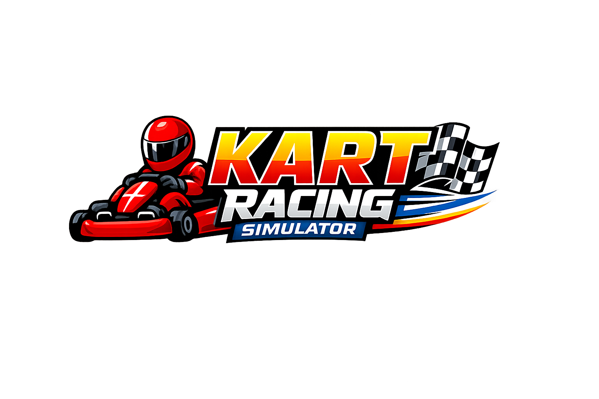

# Kart Racing Simulator



Kart Racing Simulator is a browser-based 3D arcade racing simulator built for the Interactive Graphics course. The project combines real-time Three.js rendering, spline-based track generation, procedural modeling, imported static vehicle assets, JavaScript-authored animations, lighting, textures, collisions, audio feedback, HUD systems and race logic.

## Live Demo

[https://sapienzainteractivegraphicscourse.github.io/final-project-arancin/](https://sapienzainteractivegraphicscourse.github.io/final-project-arancin/)

For the best experience, use a desktop browser with hardware acceleration enabled.

## Project Scope

The player chooses a track, a vehicle, a body color and a race mode before entering the 3D scene.

Playable vehicles:

- Porsche Cayman GT4
- Nissan Silvia S14 Kouki
- Procedural Kart

The Porsche and Silvia are imported as static 3D models and adapted at runtime. The procedural kart is the main team-authored hierarchical model, built from Three.js primitives with local pivots for wheels, steering, driver body parts and headlights.

Available tracks:

- Vegas Neon
- Tropical Beach
- Monaco Formula 1

Each track has its own spline layout, palette, lighting setup, road material, barriers, checkpoints, boost pads and decorative environment.

## Interactive Graphics Highlights

- WebGL rendering through Three.js and Vite
- Scene graph organization with local transforms and hierarchical vehicle parts
- Procedural kart model made from Three.js primitives
- Imported static Porsche and Silvia meshes with runtime material cloning and wheel pivots
- Closed Catmull-Rom spline tracks converted into road BufferGeometry
- Generated road UVs, triangle indices and vertex normals
- Procedural CanvasTexture color, roughness and normal-style maps
- Imported vehicle texture maps
- Ambient, directional, point and spot lights
- Shadow mapping on the main directional light
- Toggleable vehicle headlights with spot lights and translucent beam meshes
- Custom GLSL boost-pad ShaderMaterial driven by animated uniforms
- JavaScript-authored animations for vehicles, props, shader effects and race feedback
- Arcade vehicle simulation with acceleration, steering, braking, surface response and collision correction
- Race state, checkpoints, lap timing, AI opponent, ghost lap, HUD and minimap

No imported animation clips are used. Imported models are treated as static visual assets; gameplay movement is authored in JavaScript.

## Gameplay Features

- Race mode and time trial mode
- Three selectable vehicles with different performance profiles
- Vehicle color selection before the race
- AI opponent in race mode
- Checkpoint and lap progression
- Best lap and lap record persistence in local storage
- Wrong-way detection
- Collision handling against barriers and opponent vehicle
- Boost pads and visual feedback
- Follow, top, hood and orbit camera modes
- Free camera exploration before race start
- Runtime HUD, minimap, pause menu and finish screen
- Procedural engine audio and imported environment/event sounds

## Controls

| Action | Keys |
| --- | --- |
| Accelerate | `W` or `ArrowUp` |
| Brake / Reverse | `S` or `ArrowDown` |
| Steer left | `A` or `ArrowLeft` |
| Steer right | `D` or `ArrowRight` |
| Handbrake | `Space` |
| Change camera | `C` |
| Toggle headlights | `L` |
| Restart race | `R` |
| Pause / menu | `Esc` |

## Debug Controls

| Action | Key |
| --- | --- |
| Toggle minimap | `F1` |
| Toggle shadows | `F2` |
| Toggle decorative props | `F3` |
| Toggle renderer statistics panel | `F4` |

## Technologies

- JavaScript ES modules
- Three.js
- WebGL
- Vite
- `@tweenjs/tween.js`
- HTML
- CSS
- Web Audio API

## Project Structure

```text
src/
  config/       Race options and vehicle performance tuning
  scene/        Renderer, camera, lights and scene orchestration
  vehicles/     Vehicle classes, model loaders and vehicle factory
  tracks/       Track data, spline generation, materials and props
  systems/      Input, physics, race state, AI, audio, minimap and effects
  materials/    Procedural textures and custom shader materials
  ui/           Setup menu, HUD, overlays and screens
  styles/       Application CSS
  assets/       Imported models, textures, audio and UI images
docs/
  project-documentation.html
  project-documentation.pdf
```

## Documentation

The current project documentation is concentrated in:

- [Technical project documentation and user manual](docs/project-documentation.pdf)

The documentation covers the implementation choices required for the Interactive Graphics presentation: environment and libraries, external assets, hierarchical modeling, lights, materials, texture types, JavaScript animations, gameplay interactions, verification and known limitations.

## Local Development

Install dependencies:

```bash
bun install
```

Start the development server:

```bash
bun run dev
```

Create a production build:

```bash
bun run build
```

Preview the production build locally:

```bash
bun run preview
```


## Authors

- Matteo Genovese  2265842
- Daniele D'Alba   2267890
- Gloria Palumbo Piccionello   2268962
